# AltaPay PrestaShop Plugin

AltaPay, headquartered in Denmark, is an internationally focused fintech company within payments with the mission to make payments less complicated. We help our merchants grow and expand their business across payment channels by offering a fully integrated seamless omni-channel experience for online, mobile and instore payments, creating transparency and reducing the need for manual tasks with one centralized payment platform.

AltaPay’s platform automizes, simplifies, and protects the transaction flow for shop owners and global retail and e-commerce companies, supporting and integrating smoothly into the major ERP systems. AltaPay performs as a Payment Service Provider operating under The Payment Card Industry Data Security Standard (PCI DSS).

## PrestaShop Payment plugin installation guide

Installing this plug-in will enable the web shop to handle card transactions through AltaPay's gateway.

**Table of Contents**

[Prerequisites](#prerequisites)

[Installation](#installation)

[Configuration](#configuration)

[Subscriptions](#subscriptions)

[Reconcile Orders](#reconcile-orders)

[Styling](#styling)
*  [Customize Payment Form Page](#customize-payment-form-page)

*  [Customize Redirect Form Page](#customize-redirect-form-page)

*  [CSS Customization](#css-customization)

[Supported versions](#supported-versions)

[Plugin updates](#plugin-updates)

[Troubleshooting](#troubleshooting)

## Prerequisites

Before configuring the plugin, you need the below information. These can
be provided by AltaPay.

1.  AltaPay credentials:
      -   Username
      -   Password

2.  AltaPay gateway information:
      -   Terminal
      -   Gateway

## Installation

1. Download the latest release (altapay.zip, for PrestaShop version 1.6.x download altapay-for-prestashop-1.6.x.zip) file from the [Releases](https://github.com/AltaPay/plugin-prestashop/releases) tab

2. Go to **Admin** > **Modules** > **Module manager** and click on **Upload a module** from the top-right corner.

   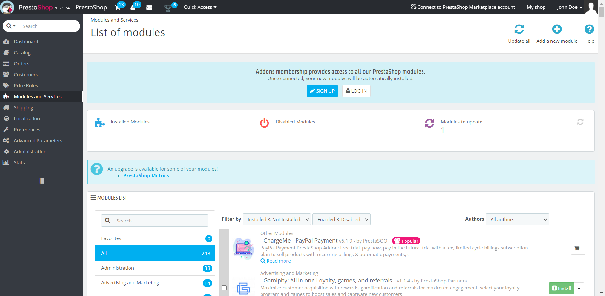

3. Now click on **select file** link from the **Upload a module** popup and upload module zip file.

   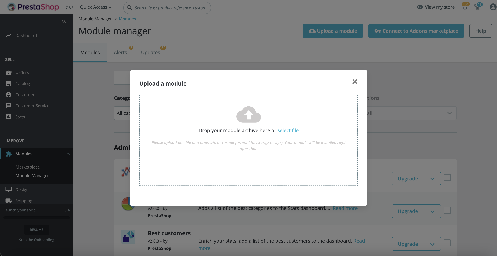

4. After the module is installed successfully, click on the **Configure** button for  configurations.

   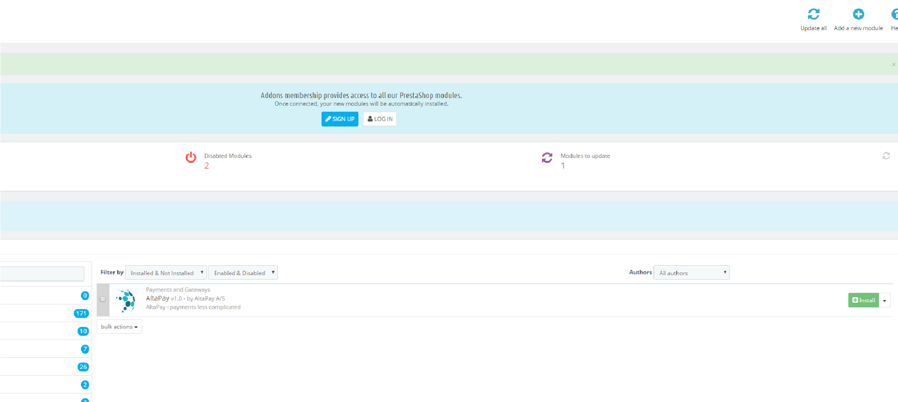

## Configuration

1. Go to **Modules** > **Module manager** and find the **AltaPay for PrestaShop** module. This can be done by searching for **AltaPay** or go to **Payment** and find the module. Click on **Configure** for the module. 

   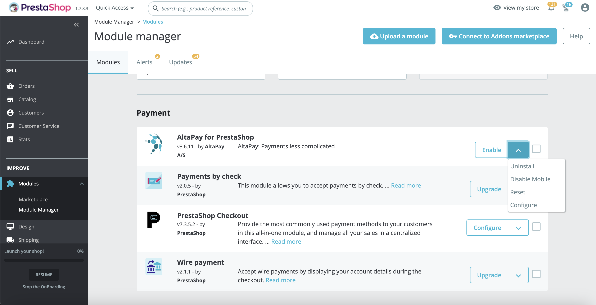

   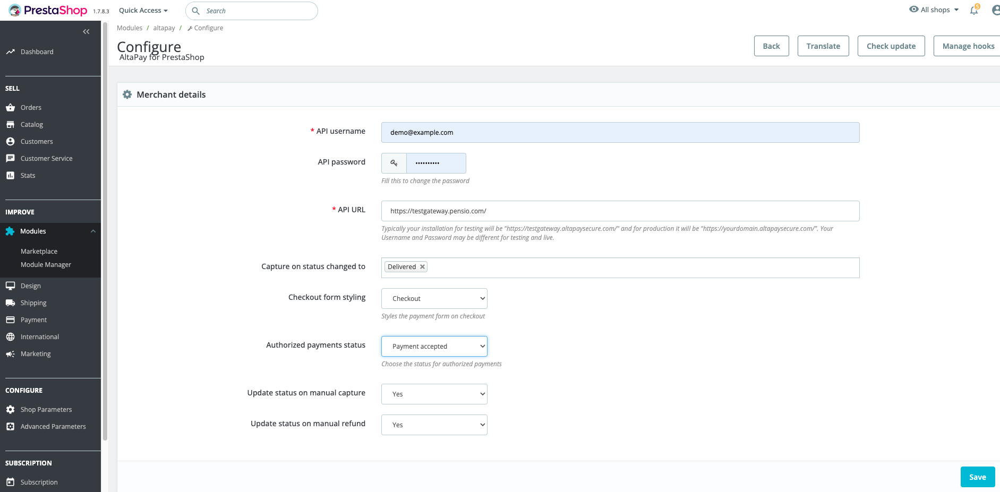

2. If you wish to enable fraud detection service and release/refund if fraud is detected then refer to the below screenshot.

   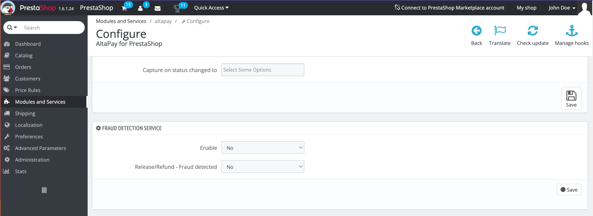

3. To synchronize the terminals with the gateway, click on the **Synchronize** button. This will fetch the latest terminals from the gateway and will automatically configure based on the store country.

   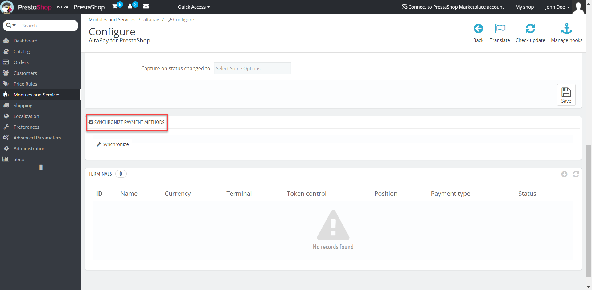

4. Now, set up the terminals. At the bottom of the module configuration page, you will find a list of terminals. There is a plus sign which you would need to click, to add a new terminal.

   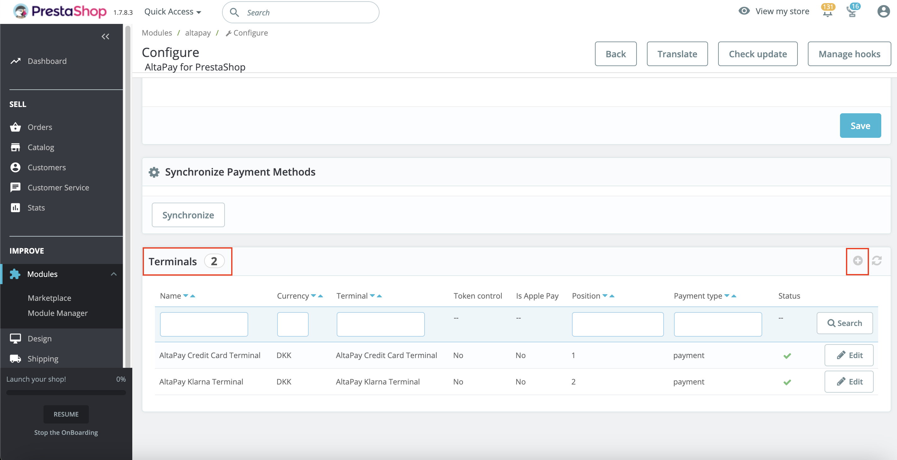

5. When setting up a terminal you must select the icon and name that is going to be shown in the checkout flow.  The currency must correspond with the currency on the terminal at AltaPay.  The payment type indicates if the money would be captured on reservation (‘Authorize and capture’) or the merchant would have to capture, when delivering the goods.

6. In the optional field **Custom message**, you can add custom message for the customers. e.g. guidelines from Danish Forbrugerombudsmanden.

7. In the optional field **Secret**, add the payment method secret as defined in the AltaPay payment gateway to enable checksum validation. To disable checksum validation leave it empty.

8. If the terminal is for Apple Pay payments, select **Yes** from the **Is Apple Pay?** dropdown.

   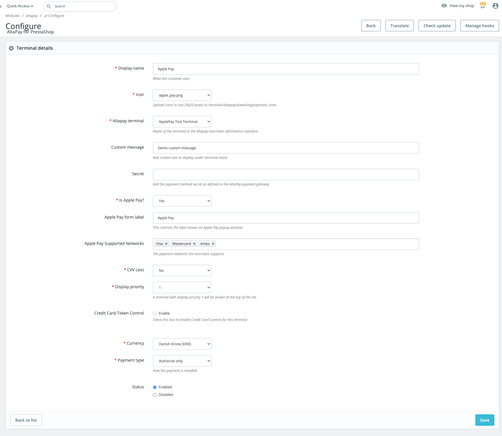

   > Note
   >
   > Apple Pay functionality is supported with Prestashop 1.7 and above only.

9. Enter value for Apple Pay Form Label.

10. Select one or more of the payment network values for Apple Pay.

11. When you have set up your terminals you are ready to process transactions through AltaPay.

      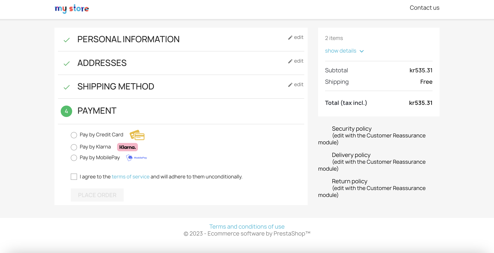

      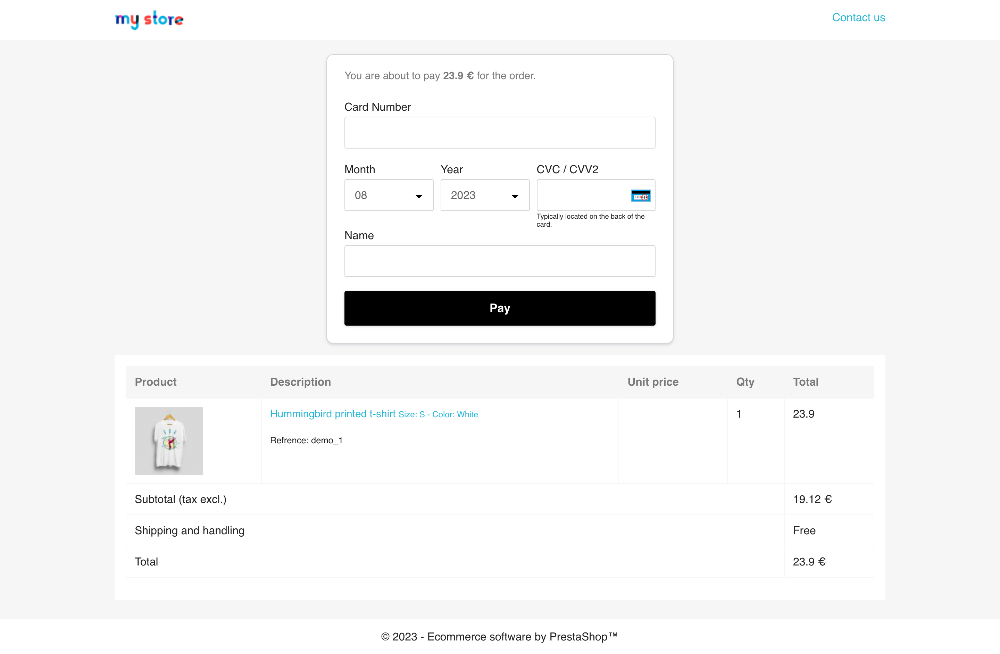

## Subscriptions

AltaPay plugin is compatible with the [Subscription Products | Recurring Payments Module](https://addons.prestashop.com/en/recurring-payment-subscription/49381-subscription-products-recurring-payments.html) to accept recurring payments.
* Please make sure the curl library is installed on your server to execute the cron tasks.
* Please remove the cron entry mentioned in [Subscription Products | Recurring Payments Module](https://addons.prestashop.com/en/recurring-payment-subscription/49381-subscription-products-recurring-payments.html) and instead insert one by AltaPay in your cron tasks manager for creating and scheduling automatic subscription orders and processing recurring payments.

   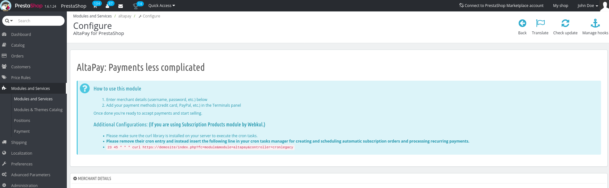

   > Note:
   >
   > Currently, AltaPay plugin supports recurring payments with the credit card terminal only.

## Reconcile Orders
In order to reconcile payments please follow the steps below:

1. Navigate to the PrestaShop **Admin** page.
2. Select **Orders** > **Orders** from the left menu.
3. Select the order you want to view.
4. Copy the **Reconciliation Identifier** from the **Payment Information** section.

   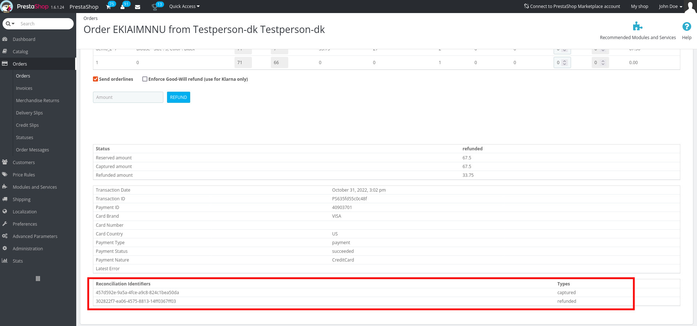

   Or export the order data to CSV from PrestaShop **SQL Manager** by clicking export button next to the **SQL query Name** `AltaPay Order Reconciliation`.
   
   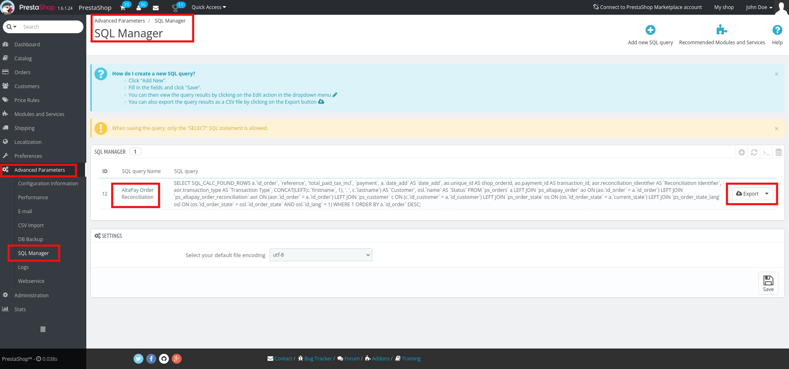
   
   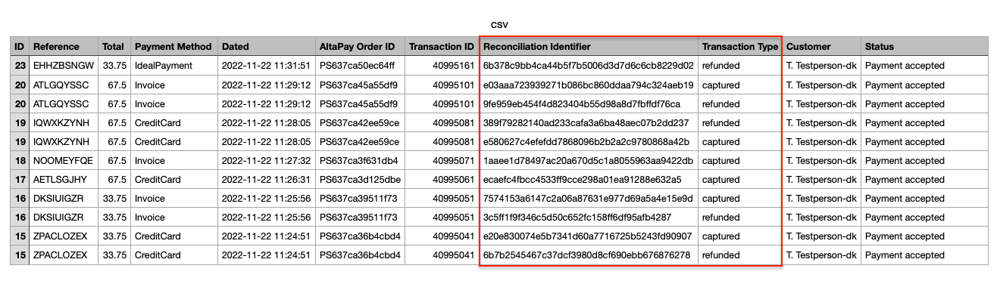

5. Navigate to AltaPay Gateway dashboard
6. Click on **FUNDING FILES** under **FINANCES** menu
7. Download the CSV file
8. Or you can find the payment in the transaction list, open the reconciliation file from there and download a csv file
9. Open the downloaded CSV file and match the **Reconciliation Identifier** with PrestaShop's **Reconciliation Identifier**.

**Sample AltaPay Gateway CSV:**

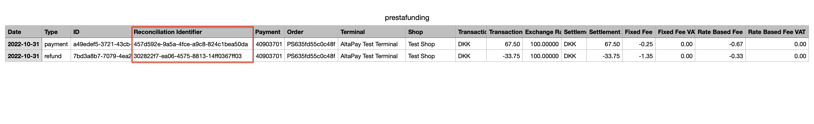

## Styling

### Payment Form Style Configuration

   Choose one of the below options from Checkout form style dropdown to change the styling of payment form on the checkout page.

   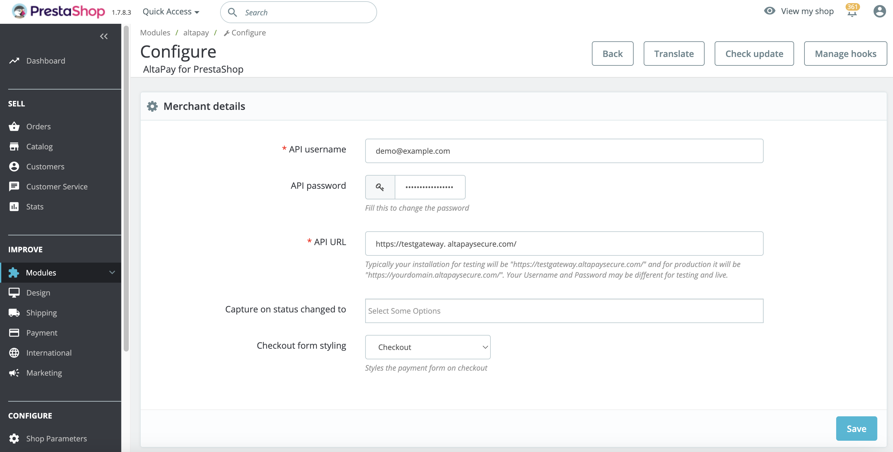

   - `Legacy` Choose this option if legacy form is enabled from the gateway side.

      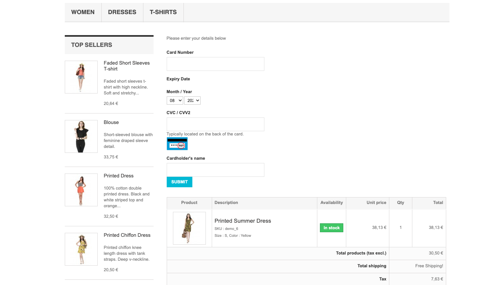

   - `Checkout` Select the option to show the Credit Card form in a modern look. Make sure the checkout form is enabled from the gateway side.

      

   - `Custom` This option can be selected to implement custom styling on the payment page. Selecting this option will remove all the styling from the payment page.

### Customize Payment Form Page:

   You can change/update the **Payment Form Page** by navigating to the below path:

   <https://github.com/AltaPay/plugin-prestashop/blob/main/views/templates/front/payment_form17.tpl>

   **Note:** If you have the at_movic theme installed, the path for the payment form is as follows:

   <https://github.com/AltaPay/plugin-prestashop/blob/main/views/templates/front/paymentform_atmovic.tpl>

### Customize Redirect Form Page:

   You can change/update the **Redirect Form Page** by navigating to the below path:

   <https://github.com/AltaPay/plugin-prestashop/blob/main/views/templates/front/payment_redirect.tpl>

   **Note:** If you have the at_movic theme installed, the path for the payment form is as follows:

   <https://github.com/AltaPay/plugin-prestashop/blob/main/views/templates/front/paymentredirect_atmovic.tpl>

### CSS Customization:

   Use the below link to apply the **CSS** to the form page:

   <https://github.com/AltaPay/plugin-prestashop/blob/main/views/css/payment.css>

## Supported versions
- PrestaShop 1.6.x (requires PHP 7.0 or later)
- Thirty Bees 1.5.x (requires PHP 7.2 or later)
- PrestaShop 1.7.x (requires PHP 7.2 or later)
- PrestaShop 8.x (requires PHP 7.2 or later)

## Plugin updates

From version 3.6.12 onwards, you will receive notification on both back office order details page and AltaPay's module configuration page when a new version of the plugin is available for installation. We recommend to update the plugin regularly upon receiving such notifications to ensure optimal performance and access to the latest features.

## Troubleshooting

**PHP Warning: Input variables exceeded 1000. To increase the limit change max_input_vars in php.ini.**

- Open your php.ini file
- Edit the max_input_vars variable. This specifies the maximum number of variables that can be sent in a request. The default is 1000. Increase it to, say, 3000.
- Restart your server.

**Parameters: description/unitPrice/quantity are required for each orderline, but was not set for line: xxxx**
> The same problem as above. The request is being truncated because the number of variables are exceeding the max_input_vars limit.

## Providing error logs to support team

**In your Prestashop system, the ‘Transaction ID’ is the ID which matches the ‘Order ID’ within the AltaPay backend. Please do not use the Prestashop Order ID as reference ID when talking to AltaPay support.**

**You can find the CMS logs by following the below steps:**

From Admin Dashboard navigate to **Advanced Parameters > Logs** 

**Web server error logs**

**For Apache server** You can find it on **/var/log/apache2/error.log** 
 
**For Nginx** it would be **/var/log/nginx/error.log** 

**_Note: Your path may vary from the mentioned above._**

